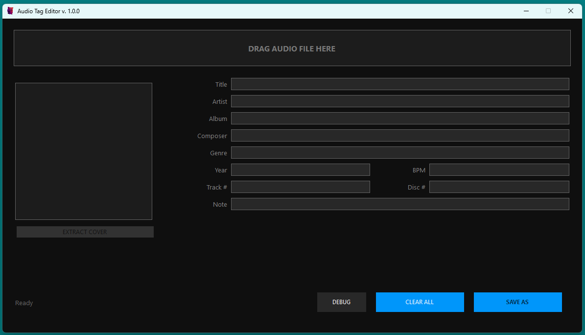

# 🎵 Audio Tag Editor (ATE) 


**ATE** — It is a fast, minimalistic, and powerful audio metadata editor.

Release - [Go to Release](https://github.com/nonergon/audio-tag-editor/releases)
<br>
Direct link for download - [Audio Tag Editor.exe](https://github.com/nonergon/audio-tag-editor/releases/download/primary/ATE.exe)

---

## 💎 Premium Features

* **Seamless Drag & Drop:** Effortlessly import tracks by dropping them directly onto the workspace.
* **Cover Art Suite:** Extract high-resolution covers from existing files or inject new ones with ease.
* **Real-time Debugging:** A dedicated developer console to monitor file I/O and tag processing.

---

## 🛠 Metadata Support

ATE Pro provides deep access to the following fields:

| Field | Description | Field | Description |
| :--- | :--- | :--- | :--- |
| **Title** | Track name | **Track #** | Position in album |
| **Artist** | Primary performer | **Disc #** | Media volume index |
| **Album** | Collection title | **BPM** | Beats per minute |
| **Year** | Release date | **Composer** | Music author |
| **Genre** | Category | **Note** | Custom comments |

---

## 🏗 Build & Installation

### Requirements
* [.NET 8.0 SDK](https://dotnet.microsoft.com/download/dotnet/8.0)
* **TagLibSharp** library (automatically restored via NuGet)

### Compiling from Source

```bash
dotnet build ATE.csproj -c Release
```
Find your portable executable in `bin/Release/net8.0-windows/ATE.exe`.


